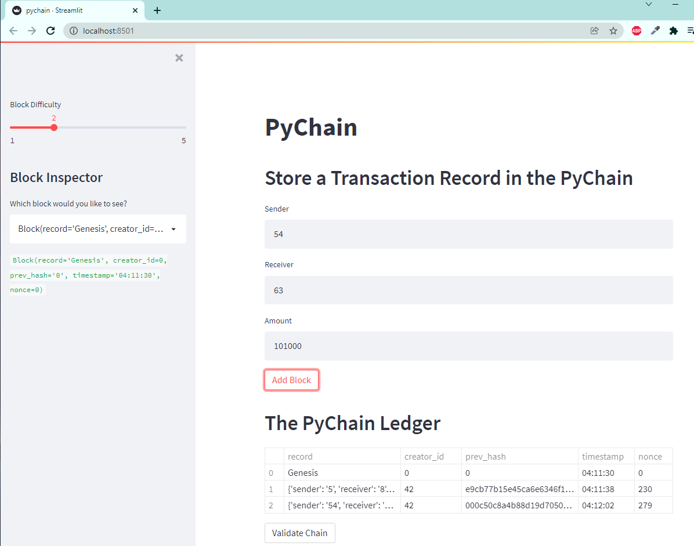

# Pychain
## Fintech Challenge 18

### Instalation
To clone the the repository use the follwoing line of code:

    git clone https://github.com/dcmar18/pychain.git

Once cloned navigate into the folder via terminal and run the following code to launch the Streamlit application:

    streamlit run pychain.py

If successful you shall see something similiar to the screenshot below:

